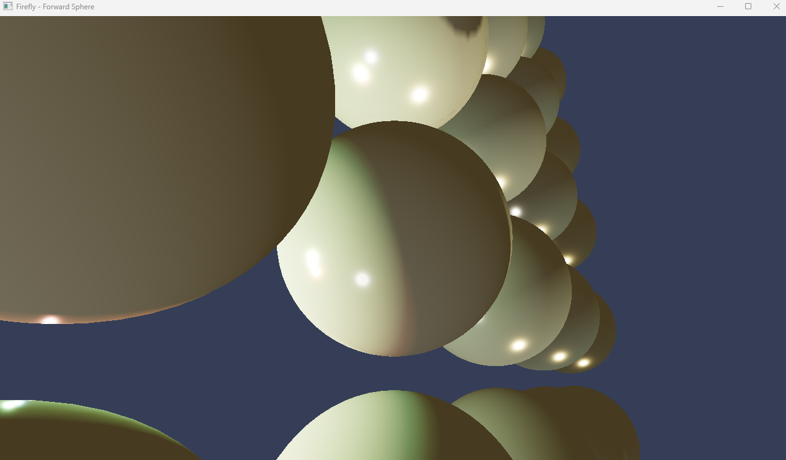
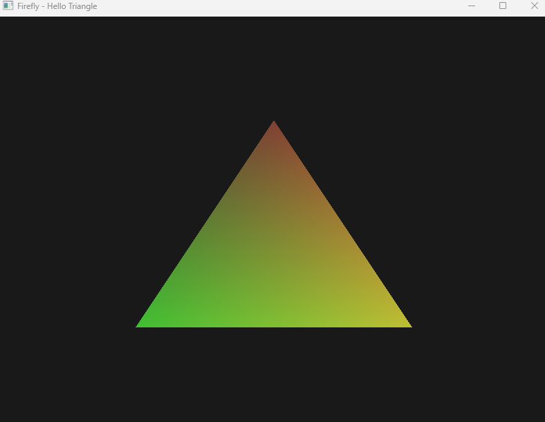
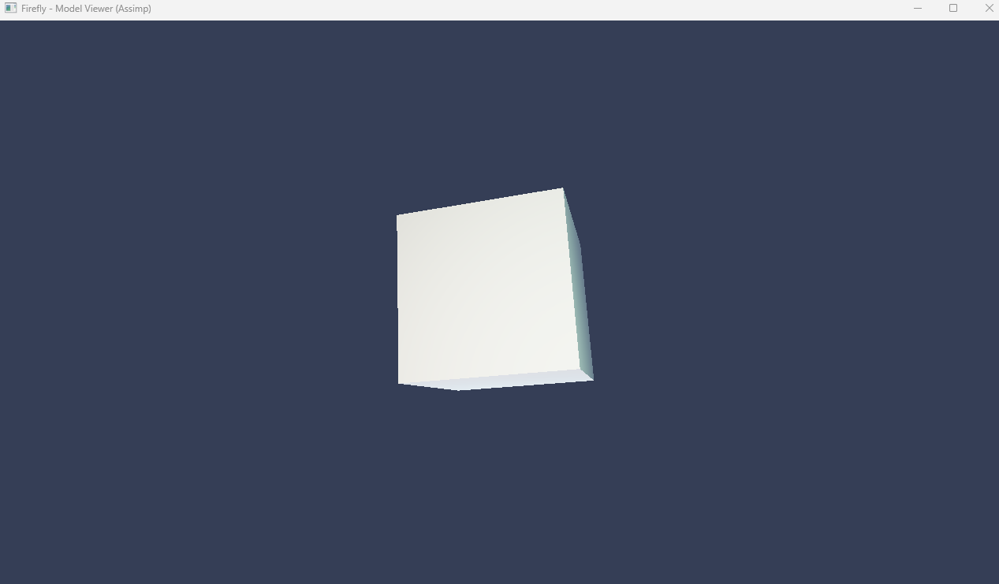

# Firefly

Firefly 是一个面向 Windows/MSVC 的现代 C++20 游戏引擎实验项目，使用 C++20 Modules、CMake、Ninja、wgpu-native、GLFW 和 Flecs 构建。项目目标是用模块化方式组织核心、平台、ECS、渲染、资源和场景系统，并通过示例程序验证基础渲染、模型加载和 ECS 驱动的应用主循环。

## 截图

### Forward Sphere



### Hello Triangle



### Model Viewer



## 特性

- C++20 Modules：核心模块、平台模块、ECS 模块、渲染模块、资源模块和场景模块分离。
- ECS 驱动：基于 Flecs 的世界、组件、系统和引擎运行阶段。
- 渲染后端：基于 wgpu-native 封装设备、缓冲区、纹理、管线、命令和前向渲染器。
- 平台层：基于 GLFW 的窗口、输入和文件系统封装。
- 资源加载：支持纹理导入和基于 Assimp 的模型导入。
- 示例程序：包含 `hello_triangle`、`forward_sphere`、`model_viewer` 和 `sponza_viewer`。
- 测试：使用 doctest，并通过 CTest 注册各模块测试。

## 目录结构

```text
firefly/
├── assets/              # 着色器、模型等运行资源
├── docs/                # 需求、设计和任务文档
├── examples/            # 示例程序
├── screenshoot/         # README 使用的运行截图
├── src/                 # 引擎源码
│   ├── core/            # 基础类型、日志、时间、事件和 App
│   ├── ecs/             # Flecs 封装、组件、系统和引擎 phases
│   ├── platform/        # 窗口、输入和文件系统
│   ├── renderer/        # WGPU 封装、渲染器、材质、网格和相机
│   ├── resource/        # 资源管理和导入器
│   └── scene/           # 场景与节点管理
├── tests/               # doctest/CTest 测试
├── third_party/         # 固定版本第三方依赖
└── tools/               # Ninja 等辅助工具
```

## 环境要求

- Windows 10/11
- Visual Studio 2022 或 2019，安装 MSVC x64 工具链
- CMake 3.28+
- Ninja，仓库内已包含 `tools/ninja/ninja.exe`
- 支持 wgpu-native 运行的图形驱动

## 构建

优先使用根目录的 `build.bat`。脚本会查找 Visual Studio 的 `vcvarsall.bat`，初始化 MSVC x64 环境，然后调用 CMake/Ninja。

```bat
build.bat clean debug
build.bat build debug
```

Release 构建：

```bat
build.bat clean release
build.bat build release
```

也可以手动使用 CMake preset：

```bat
cmake --preset=default
cmake --build --preset=debug
```

## 测试

每次测试前建议先清理对应构建目录，避免 C++20 模块缓存影响结果。

```bat
build.bat clean debug
build.bat test debug
```

Release 测试：

```bat
build.bat clean release
build.bat test release
```

## 运行示例

构建完成后，示例程序位于对应 preset 的构建目录中：

```text
build/default/examples/hello_triangle/hello_triangle.exe
build/default/examples/forward_sphere/forward_sphere.exe
build/default/examples/model_viewer/model_viewer.exe
build/default/examples/sponza_viewer/sponza_viewer.exe
```

示例目标会在构建后复制 `wgpu_native.dll`；模型查看器相关示例还会复制 Assimp 运行时 DLL。

## 模块概览

| 模块 | 说明 |
|---|---|
| `firefly_core` | 基础类型、日志、时间、事件、引擎入口和 App |
| `firefly_ecs` | Flecs World 封装、组件、系统和引擎运行阶段 |
| `firefly_platform` | GLFW 窗口、输入和文件系统 |
| `firefly_renderer` | WGPU 资源、渲染管线、命令、材质、网格、相机和前向渲染 |
| `firefly_resource` | 纹理导入、模型导入和资源管理 |
| `firefly_scene` | 场景、场景节点和场景管理 |
| `firefly_app` | ECS 驱动的应用层整合 |

## 第三方依赖

| 依赖 | 用途 |
|---|---|
| wgpu-native | 图形 API 抽象与渲染后端 |
| GLFW | 窗口和输入 |
| Flecs | ECS |
| GLM | 数学库 |
| spdlog | 日志 |
| nlohmann/json | JSON 支持 |
| stb_image | 图像加载 |
| Assimp | 模型导入 |
| doctest | 单元测试 |

## 文档

- [需求文档](docs/requirements.md)
- [设计文档](docs/design.md)
- [任务列表](docs/tasks.md)

## 开发约定

- 使用 C++20 和 MSVC，项目开启 `/W4` 与 `/utf-8`。
- 模块接口使用 `.cppm`，实现使用 `.cpp`。
- 类型名使用 `PascalCase`，函数、变量和文件名使用 `snake_case`。
- 新增功能应补充对应模块测试。
- 提交前建议运行 `build.bat clean debug` 和 `build.bat test debug`。
